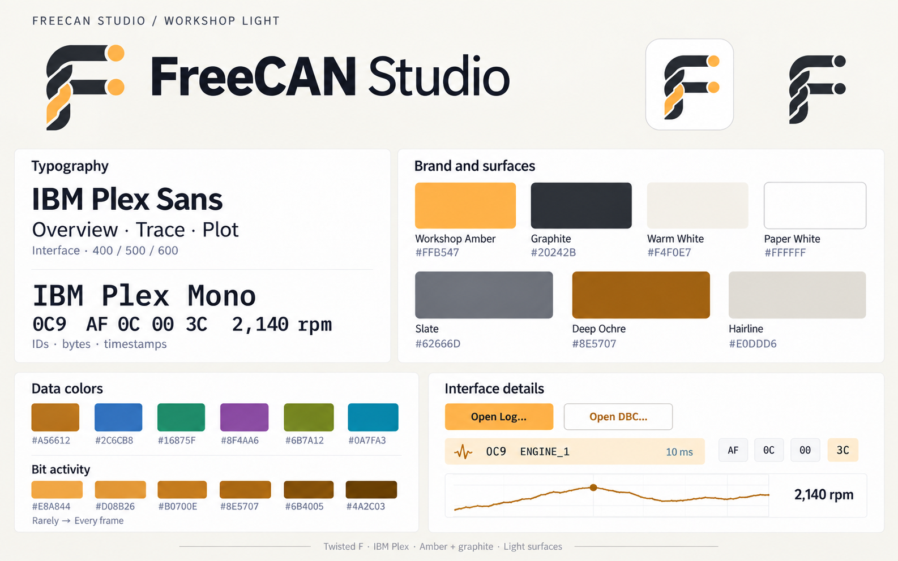

# FreeCAN Studio



**Approved identity: Workshop Light.** Twisted F mark - IBM Plex Sans for the interface - IBM Plex Mono for data - amber `#FFB547`, graphite `#20242B`, warm white `#F4F0E7`, and white content surfaces.

[Full-size brand sheet](docs/freecan-workshop-brand-guide-v2.png) - [Design system and exact color values](DESIGN.md) - [Screen mockups](docs/screens.md#approved-workshop-light-mockups)

A free, browser-based CAN bus analyzer and log viewer with reverse-engineering tools. FreeCAN Studio Pro, a paid desktop app on the same core, is planned. The stack rationale is in [docs/research.md](docs/research.md) and the naming research in [docs/naming.md](docs/naming.md).

Everything runs client-side: a Rust core compiled to WebAssembly in a Web Worker, and a React/TypeScript UI. The desktop build will run the same crates natively under Tauri, behind the same `CoreApi` interface ([web/src/core/api.ts](web/src/core/api.ts)).

## Layout

| Path | What |
|---|---|
| `crates/can-core` | Frame types; columnar frame store with per-ID stats and bit-flip counts |
| `crates/can-formats` | Streaming log parsers: candump, Vector ASC and BLF, PEAK TRC, ASAM MF4 and CSV, chosen by file name and content |
| `crates/can-dbc-model` | DBC loading via `can-dbc`, our own editable model, signal decode and encode |
| `crates/can-wasm` | wasm-bindgen `Session` used by the web worker; min/max plot decimation |
| `crates/sample-gen` | Dev tool: synthetic demo log + DBC, native benchmark, decode dumps |
| `web/` | Vite + React UI: canvas trace table, bit heatmap, uPlot plots |
| `site/` | The landing site for `freecanstudio.com`: static HTML, no build ([site/README.md](site/README.md)) |
| `scripts/crosscheck_cantools.py` | Compares our decoder with cantools |
| `scripts/gen_extended_mux.py` | Test log + DBC with nested multiplexors, for the cantools cross-check |

## Develop

Needs Rust with the `wasm32-unknown-unknown` target, `wasm-pack`, Node and pnpm.

```bash
cd web && pnpm install
```

Build the wasm core. Rerun this after any Rust change.

```bash
cd web && pnpm wasm
```

Generate the demo: a 1M-frame log, gzipped to `web/public/demo/demo.log.gz` (the raw log stays in `target/demo/demo.log`), and `web/public/demo/demo.dbc`. CONTRIBUTING.md shows how to make a bigger one.

```bash
cd web && pnpm demo
```

Start the dev server, then open the page and click **Try the Demo** or drop a log and a DBC. The formats read are listed in [COMPATIBILITY.md](COMPATIBILITY.md#log-formats).

```bash
cd web && pnpm dev
```

Tests:

```bash
cargo test --workspace
```

Rewrite the demo in another format to try the parsers on it (the extension picks the format: `.asc`, `.trc`, `.csv`, `.blf` or `.mf4`):

```bash
cargo run --release -p sample-gen -- convert target/demo/demo.log target/demo/demo.asc
```

Cross-check the decoder against cantools (needs `pip install cantools`):

```bash
cargo run --release -p sample-gen -- decode target/demo/demo.log web/public/demo/demo.dbc 300000 > /tmp/ours.csv
python scripts/crosscheck_cantools.py target/demo/demo.log web/public/demo/demo.dbc /tmp/ours.csv 300000
```

## Deploy

The app and the landing site are two Cloudflare Workers projects. The app (`wrangler.jsonc`, project `freecan-studio`) is served on `app.freecanstudio.com`; the landing site (`site/wrangler.jsonc`, project `freecan-studio-landing`) on `freecanstudio.com`. `freecan.studio` and `freecan.app` redirect to `freecanstudio.com` through Cloudflare redirect rules set up by the owner. See "Deployment" in [CONTRIBUTING.md](CONTRIBUTING.md).

## Spike results (2026-09-30, Apple Silicon, Chromium)

These use the 10M-frame demo: a 552 MB candump file, about 5 h of driving, 11 IDs on two buses, including CAN FD and J1939.

| | Result |
|---|---|
| Native parse (`sample-gen bench`) | 285 MB/s, 5.2M frames/s |
| Browser parse (wasm, one worker) | 2.7 s, 207 MB/s |
| wasm memory after load | 654 MB. Frame data is about 350 MB; the rest is `Vec` growth slack (see below) |
| Trace page (40 rows) round trip | 0.5 ms |
| Plot re-query, 1.8M points decimated to 1,800 | 9.7 ms |
| Decoder vs cantools | 1,622,498 values from 300k frames, all equal |
| Web bundle (gzip) | 99 kB JS + 117 kB wasm |

## Known gaps / next steps

- **Memory:** the store's columns are plain `Vec`s, and doubling on growth nearly doubles peak memory. Switch to fixed-size chunked columns to hold wasm memory close to the actual data size.
- **Formats:** candump, Vector ASC, Vector BLF (CAN objects), PEAK TRC, ASAM MF4 (CAN bus logging) and CSV (python-can, SavvyCAN and generic header-named layouts) are supported, all through the `LogParser` interface. MF4 is buffered and read when the file ends, up to 1 GiB, because its blocks link anywhere in the file; its data is then read a block at a time and the frames merged by time, so a 112 MB, 10M-frame MF4 takes about 610 MB of wasm memory (the file plus the frames). Not read: CAN XL, LIN, FlexRay and Ethernet frames, and MF4 files of decoded signals rather than bus frames.
- **Parallel parsing:** add a pool of workers parsing `Blob.slice` ranges for multi-core throughput.
- **Plot queries:** add level-of-detail pyramids so a query no longer scales linearly with the points in range.
- **Reverse engineering:** drag-to-define signals on the heatmap, a scrubbable time window for bit flips, counter/CRC auto-labels, and DBC export.
- **DBC:** extended multiplexing (`SG_MUL_VAL_`) is not decoded yet.
